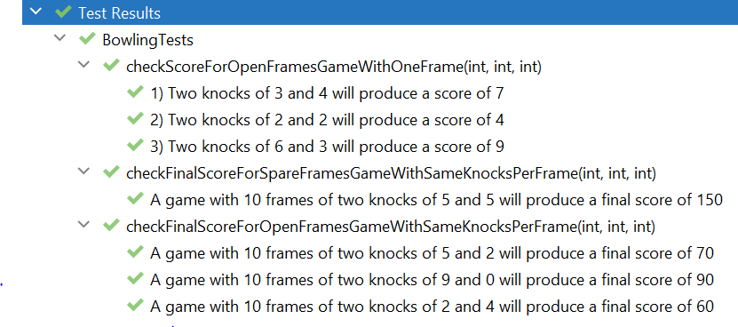

# TDD bowling game kata
Test Driven Development exercise for a bowling game.

### What is a kata?

A Kata in martial arts means “a system of individual training exercises”. Just like in martial arts, coding also requires consistent practise to hone in the skill.

### What is the goal?

Plan out and spend 30-45 minutes having a go at the Bowling Game Kata using Test-Driven Development. It is not expected to have a finished solution but have had a good go at using Test-Driven Development.

### Instructions

- Read the Bowling Game kata requirements at Coding Dojo: https://codingdojo.org/kata/Bowling/
- Solve the Bowling Game kata in Java programming language.

### Solution:
- There are 3 types of frames in the solution:
  - OPEN frame, when there are 2 throws and both don't add upo to 10.
  - SPARE frame, when there are 2 throws and both add up to 10.
  - STRIKE frame, when the first throw is a 10.
- I started adding the simplest test of checking the score for one open frame.
- Then I continue testing a whole game of ten OPEN frames that checked the final score.
- After that I tested a whole game with ten SPARE frames that checked the final score.
- Please check the commits to see how was the TDD process.
- Please also feel free to clone the code and run all the tests locally.
 
Here you have quick overview of all the tests passing:

Click [here](src/test/java/clan/techreturners/BowlingTests.java) to see the Bowling tests.

Click [here](src/main/java/clan/techreturners/Bowling.java) to see the Bowling code.

### What's next?:
- Continue developing the solution to consider all possible combination of frames in a game.
- Refactor the tests to avoid DRY principle.
- Add tests for edge case scenarios.
- Add validations to notify when the game is over.
- As an extra feature we can consider multiple players taking turns.

---
## How to run the tests
- cd to the project root folder in the command line
- ``mvn test``

## Technology
This project was built using:
- Java version 17.0.2
- JUnit 5.8.2 for unit testing
- Apache Maven 3.8.5 as project manager
- Community Edition for the IntelliJ 2021.3.2 development environment.
